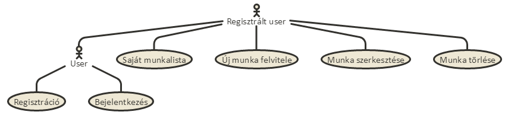
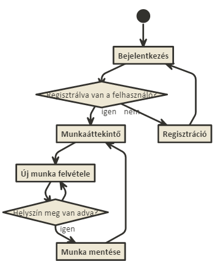

# munkabejelento
##Az ELTE IK Alkalmazások fejlesztése tárgy keretein belül készített 1. beadandó

======

______
##Követelményanalízis

#####**Funkcionális elvárások**
- Legyen lehetőség regisztrációra
- Legyen lehetőség bejelentkezésre
- Bizonyos funkciók csak bejelentkezést követően legyenek elérhetőek
- Az alkalmazással a regisztrált felhasználók tudjanak létrehozni munkalapokat
- Saját munkalapokat lehessen  (leírást és helyszínt, az érzkezési és távozási idő és státusz automatikusan állítódik)
- Saját munkalapokat lehessen törölni
- Saját munkalapok adatainak megtekintése egy listában

#####**Nem funkcionális követelmények**
- Hibalehetőségek elkerülése
- Jelszavak biztonságos kezelése
- A felület jól átlátható, használata egyszerű

#####**Használatieset-modell**
######Szerepkörök:
- Vendég: A vendég felhasználó csak a publikus oldalakat és funkciókat érheti el.
Ezek az alábbiak:
  - főoldal
  - bejelentkezés
  - regisztráció.
- Regisztrált felhasználó
  - saját munkalapok listájának(részletes adatokkal) megtekintése 
  - új munkalap felvétele
  - saját, már meglévő munkalap szerkesztése
  - saját, már meglévő munkalap törlése

______
##Tervezés
______
##Implementáció

- Fejlesztői környezet:
  - Keretrendszer: NODE.js
  - Fejlesztőkörnyezet : Cloud 9 (online)
  
- Könyvtárstruktúrában lévő mappák funkiója:
  - controllers: endpoint kezelőket (Router) tartalmmazza
  - models: adatmodellek szerkezetének leírását tartalmazza
  - public: a megjelenítésért felelős keretrendszereket(bootstrap, bootswatch) tartalmazza 
  - views : az endpointokhoz tartozó hbs fájlokat tartalmazza
  - viewmodels: a munkalapok állapotának jelzését tartalmazza
  - controllers: a csoportosított endpoint kezelőket (Router) tartalmmaza

______
##Tesztelés
______
##Felhasználói dokumentáció
#####**Telepítés lépései:**
- A webes alkalmazásunk GitHubról tölthető le. Kicsomagolás után feltölthető szerverre, majd a server.js futtatásával elindul a program.

#####**A program használata**
- Keressük fel a weboldalt, ahol fut az alkalmazásunk
- Regisztráljunk, ha szeretnénk az összes szolgáltatást igénybevenni
- Bejelentkezés után látható a felhasználó bejelentett munkái
- Az Új munka felvitele gomb után lehetőség van új munka rögzítésére
  - Az érkezési idő automatikusan az új munka rögzítésének időpontja lesz, később nem módosítható
  - A helyszín kitöltése kötelező
  - A leírás kitültése opcionális
- A Módosítás gombra kattintva módosíthatjuk a helyszín és leírás mezőket. A távozási idő automatikusan rögzítésre kerül a módosítás időpontjával.
- A Törlés gombra kattintva törölhetjük az adott munkát

Ajánlat a program helyes használatához:
- Munkahelyre éréskor program indítása
- Munka kezdése előtt közvetlenül létrehozunk egy új munkát, megadjuk a munkavégzés helyszínét
- Távozás előtt közvetlenül módosítjuk a munkát, megadjuk a leírásban az elvégzett munkát